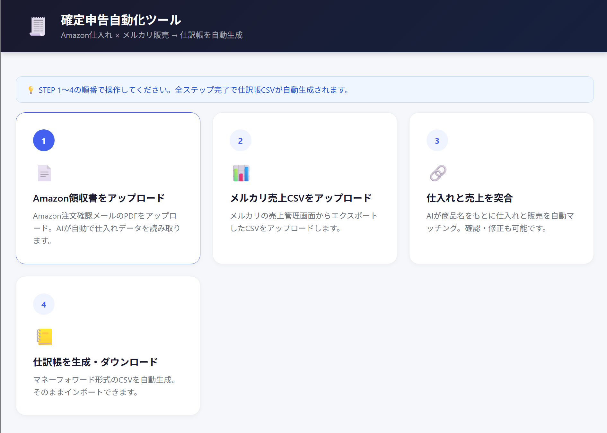

# 確定申告自動化ツール

Amazon仕入れ → メルカリ販売の物販ビジネス向け確定申告支援ツール。
自身が運営する物販事業の帳簿付け（年間約10時間の手作業）を自動化するために開発しました。

## 機能

- Amazon適格請求書（PDF）からの仕入れデータ抽出（Gemini API使用）
- メルカリ売上CSVの取り込み（キャンセル・返品の自動除外つき）
- 仕入れと販売の紐付け・在庫管理
- マネーフォワード形式での仕訳CSV出力（Shift-JIS）

## 📸 スクリーンショット



## 技術スタック

| 領域 | 技術 |
|---|---|
| バックエンド | Python / FastAPI / SQLAlchemy |
| データベース | SQLite |
| AI | Gemini API（PDFからの構造化データ抽出） |
| フロントエンド | Jinja2 + Vanilla JS |
| 環境 | Docker / docker-compose |

## 処理フロー

```
Amazon請求書PDF ──→ Gemini APIで構造化抽出 ──→ 確認・修正画面
                                                    │
メルカリ売上CSV ──→ パース・キャンセル除外 ──────────┤
                                                    ▼
                                          仕入れ↔販売の紐付け
                                                    │
                                                    ▼
                                  仕訳CSV生成（マネーフォワード形式）
```

## 設計上の判断

**FastAPIを選んだ理由**
以前Flaskで別ツールを作った経験から比較し、自動生成されるAPIドキュメント（/docs）とPydanticによる型バリデーションが開発効率に効くと判断しました。

**SQLiteを選んだ理由**
シングルユーザーのローカルツールであり、同時接続やスケールの要件がないため。DBサーバーの管理コストをなくし、Dockerボリュームにファイル1つで永続化できる構成にしています。

**AI抽出に「確認・修正」ステップを挟んでいる理由**
税務データは誤りが許されないため、Geminiの抽出結果をそのままDBに保存せず、必ず人間が確認・修正してから確定する設計にしています。

**仕訳生成の工夫**
1取引につき「売上（売掛金/売上高）」「販売手数料」「配送料」の3仕訳を複式簿記のルールに沿って生成します。キャンセル・返品ステータスの取引は仕訳から自動除外されます。出力CSVは会計ソフトでの取り込みを考慮しShift-JISです。

## セットアップ

1. Gemini APIキーを取得（https://aistudio.google.com/app/apikey）
2. 環境変数を設定して起動

```bash
cp .env.example .env
# .env を編集して GEMINI_API_KEY を設定
docker-compose up -d
```

3. ブラウザで http://localhost:8000 にアクセス

停止は `docker-compose down`。

## 使い方

1. Amazon適格請求書（PDF）をアップロード
2. AIが抽出したデータを確認・修正して保存
3. メルカリ売上CSVをアップロード
4. 仕入れと販売を紐付け
5. マネーフォワード形式で仕訳CSVを出力

## トラブルシューティング

**ポート8000が使用中の場合**: `docker-compose.yml` の `ports` を `"8001:8000"` などに変更してください。

**データのリセット**:
```bash
rm -rf data/data.db uploads/* outputs/*
docker-compose restart
```

## 対応済みの改善

- **Gemini SDK移行**: 開発時点では `google-generativeai` を使用していたが、非推奨となったため `google-genai` + `gemini-1.5-flash` に移行済み。別プロジェクト（kaitori-monitor）で外部サービスの仕様変更により機能が動かなくなった経験から、外部API依存箇所は定期的な追従が必要だと学んだ
- **テスト追加**: セキュリティ修正（パストラバーサル・XSS対策）とあわせてpytestを導入済み
- **セキュリティ修正**: ファイルアップロード時のパストラバーサル対策、テンプレートのXSS対策を実施

## 既知の課題・今後の改善

- **青色申告対応**: 現在は白色申告（収支内訳書）前提。複式簿記の仕訳は出力済みのため、青色申告決算書への対応を検討中
